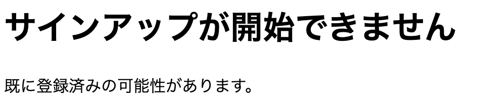

Node-REDで作る空メール登録システム
================

# 概要

SendGridとNode-REDを利用した空メール登録システムのサンプルアプリケーションです。記事は[SendGridのブログ](https://sendgrid.kke.co.jp/blog/)にて公開しています。

# 環境構築

## 前提条件

今回利用したツールとそのバージョンは次の通りです。

- Node.js：v16.5.0
- Node-RED：v2.0.6
- Gitクライアント：v2.31.1
- ngrok：v2.3.35
- Docker Engine：v20.10.8
- docker-compose：v2.0.0-rc.2

MacOSおよびAmazon Linux上で動作確認しています。各ツールのインストールを完了させます。

## 手順
### ngrokの起動
まずはじめに、Inbound Parse Webhookを受信するためにngrokを起動します。1880はNode-REDの待ち受けポート番号です。

```
$ ngrok http 1880
```

起動すると自動的にホスト名が付与されるのでメモしておきます。このホスト名は後でいくつかの場所に設定していきます。

||
|:-|

### Inbound Parse Webhookの設定
[ドキュメントの手順](https://sendgrid.kke.co.jp/docs/Tutorials/E_Receive_Mail/receive_mail.html)に従ってInbound Parse Webhookを設定します。ポイントは以下のとおりです。

- **Receiving Domain**
    - メールの宛先ドメイン
- **Destination URL**
    - 「https://＋ngrokの待受ホスト名＋/inbound 」のフォーマットで指定します
    - 例：https://5eae-101-110-33-89.ngrok.io/inbound
- **Additional Option**
    - チェックはすべてOFFにします

||
|:-|

### APIキーの作成
[ドキュメントの手順](https://sendgrid.kke.co.jp/docs/Tutorials/A_Transaction_Mail/manage_api_key.html)に沿ってAPIキーを作成します。必要なパーミッションは「**Mail Send**」の「**Full Access**」です。

||
|:-|

作成したAPIキーは、次の手順で使用するためクリップボードにコピーしておきます。

||
|:-|

### 環境変数の登録
環境変数に以下のキーと値を登録します。

|  キー  |  値  |
| ---- | ---- |
|  HTTP_HOSTNAME  |  ngrokのホスト名<br>例：5eae-101-110-33-89.ngrok.io  |
|  API_KEY  |  SendGridのAPIキー<br>例：SG.xxxxxxxxxxxxx.xxxxxxxxxxxxxx  |

以下は「**~/.bash_profile**」に登録する例です。`source`コマンドで設定したファイルの内容を読み込んでおきます。

```
$ less ~/.bash_profile

export HTTP_HOSTNAME="5eae-101-110-33-89.ngrok.io"
export API_KEY="SG.xxxxxxxxxxxxx.xxxxxxxxxxxxxx"

$ source ~/.bash_profile
```

### Node-REDの起動
Node-REDを起動します。ポート番号1880で待ち受け開始したことを確認します。

```
$ cd ~/.node-red
$ node-red
〜〜省略〜〜
6 Sep 18:10:05 - [info] フローを開始します
6 Sep 18:10:05 - [info] フローを開始しました
6 Sep 18:10:05 - [info] サーバは http://127.0.0.1:1880/ で実行中です
```

### Node-REDのプロジェクトを有効化
Node-REDの**settings.js**ファイルを編集します。

```
$ vi ~/.node-red/settings.js
```

「**editorTheme > projects > enabled**」の値を「**true**」に変更して[プロジェクト機能を有効化](https://nodered.jp/docs/user-guide/projects/#%E3%83%97%E3%83%AD%E3%82%B8%E3%82%A7%E3%82%AF%E3%83%88%E3%82%92%E6%9C%89%E5%8A%B9%E5%8C%96%E3%81%99%E3%82%8B)します。

```
  editorTheme: {
       projects: {
           enabled: true
       }
   },
```

**settings.js**ファイルを編集ししたら一度Ctrl+CキーでNode-REDを停止後、再起動します。

```
^C6 Sep 18:12:07 - [info] フローを停止します
6 Sep 18:12:07 - [info] フローを停止しました

$ node-red
〜〜省略〜〜
6 Sep 18:10:05 - [info] フローを開始します
6 Sep 18:10:05 - [info] フローを開始しました
6 Sep 18:10:05 - [info] サーバは http://127.0.0.1:1880/ で実行中です
```

### プロジェクトの初期設定
ブラウザから「http://localhost:1880/ 」にアクセスしてNode-REDのフローエディタを表示します。プロジェクトの初期設定画面が表示されるので「**Clone Repository**」を選択します。


GitHubの「**Username**」と「**Email**」を設定して「**Next**」を選択します。

||
|:-|

以下のように設定して「**Clone project**」を選択します。

- **Project name**
    - node-red-example
- **Git repository URL**
    - https://github.com/SendGridJP/node-red-example

||
|:-|

いくつかのノードタイプがない旨エラーメッセージが表示されますが、ここではひとまず「**Close**」を選択して閉じます。

||
|:-|

画面右上のメニューから「**Projects > Project Settings**」を選択します。

||
|:-|

「**Dependencies**」を選択して、それぞれの依存関係をインストールします。

||
|:-|

「**Close**」を選択して設定画面を閉じます。

||
|:-|

一度ブラウザの画面をリロードして環境構築が完了です。

||
|:-|

# 動作確認

## 空メール送信
Inbound Parse Webhookで設定した受信ドメイン宛に空メールを送ります。ローカルパートは適当な文字列を指定します。

||
|:-|

ngrokがInbound Parse Webhookを受信すると「**200 OK**」が表示されます。

||
|:-|

Node-REDの画面上で「**debug**」ボタンを選択すると、デバッグログが確認できます。この中に「**statusCode: 202**」の表示があれば、SendGridに対するメール送信リクエストが成功しています。

||
|:-|

しばらく待つとユーザー登録用メールが届くので、メール本文内のURLにアクセスします。

||
|:-|

ブラウザ上にユーザー登録フォームが表示されるので、適当なニックネームを入力して「**送信**」を選択します。

||
|:-|

登録に成功すると以下のようなメッセージが表示されます。

||
|:-|

一方、既に同じメールアドレスが登録済みなど、登録に失敗した場合は以下のようなメッセージが表示されます。

|<br>|
|:-|

||
|:-|

以上で動作確認完了です。

# 注意点
このサンプルを利用する際の注意点は以下の通りです。

- データベースのパスワードはdocker-compose.ymlに直書きしてあるので、環境変数から読み込むようにするなど、パスワードが晒されないようにしてください
- ノードのプロパティに保存する認証情報を暗号化する場合は、Node-REDのセキュアパラメータ暗号化機能を有効化してください
